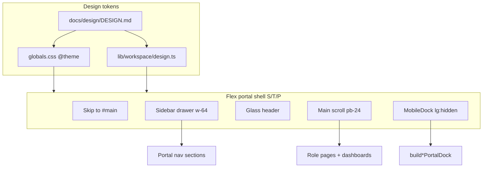
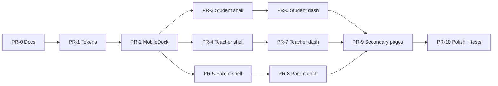

# ZamSchool Mobile Portals — Implementation Plan (PR Plan)

| Field | Value |
|-------|--------|
| Status | Draft |
| Date | 2026-07-12 |
| Scope | Student / Teacher / Parent mobile-first UX in `Zamschool-main` |
| Visual system | [DESIGN.md](./DESIGN.md) |
| Source of truth (UX shell patterns) | `C:\zamschool-os-app-main` flex shells + dashboards |
| Implementation target | `C:\Zamschool-main` (Next.js App Router) |

---

## 1. Intent

Ship a **mobile-first** experience for **Student, Teacher, and Parent** roles that looks and navigates like the reference workspaces in `zamschool-os-app-main`, while implementing against the product codebase `Zamschool-main`.

Phase 1 does **not** redesign admin, principal, payments, or other staff workspaces (except shared primitives when required).

**Platform decision:** evolve the existing Next.js flex shells (`StudentShell`, `TeacherShell`, `ParentShell`) + `MobileDock`. No separate native app in v1.

---

## 2. Current state (verified)

### Tokens
Both apps already share the same core `@theme` tokens in `app/globals.css` (canvas, brand, role stats, radius, shadows, motion).

### Divergence that this plan closes

| Area | Reference (`zamschool-os-app-main`) | Product (`Zamschool-main`) | Plan |
|------|-------------------------------------|----------------------------|------|
| Nav active accent | Role-tinted (`shellNavClass` teal/indigo) | Monochrome slate (`accent` ignored) | Restore role accents for S/T/P portals |
| MobileDock active | teal / sky / green | Monochrome (`activeAccent` deprecated) | Re-enable role accents for S/T/P |
| `roleStatSurface` | Violet / amber / orange gradients | Flattened slate | Restore role gradients for portal stats |
| Student shell identity | Class label only | Rich desk block (name \| class \| number) | Keep main’s identity block; align chrome accents |
| Student nav sections | Today / School work / Account (+ events, notifications) | School / My work / Account (leaner) | Align to product IA; docks already good |
| Teacher dock | Dashboard, Inbox, Students, Teaching, Settings | Dashboard, Inbox, Students, Attendance, Profile | Keep product dock (attendance-first) |
| Parent dock | + Fees | + Fees | Keep 5-item dock |
| Badges | Limited | `useNavBadges` + dock badges | Keep product badges |

### Key files (product)

| Concern | Path |
|---------|------|
| Tokens | `app/globals.css` |
| Surface helpers | `lib/workspace/design.ts` |
| Nav + docks | `lib/workspace/nav.ts` (`studentPortalSections`, `teacherPortalSections`, `parentPortalSections`, `build*PortalDock`) |
| Shells | `components/StudentShell.tsx`, `TeacherShell.tsx`, `ParentShell.tsx` |
| Dock | `components/workspace/MobileDock.tsx` |
| Nav menu | `components/workspace/WorkspaceNavMenu.tsx` |
| Loader | `components/workspace/WorkspaceLoader.tsx` |
| Student dashboard | `components/student/dashboard/*` |
| Teacher dashboard | `components/teacher/dashboard/*` |
| Parent dashboard | `components/parent/dashboard/*` |
| Offline | `components/OfflineStatusBanner.tsx`, `public/sw.js` |
| Role shell router | `components/RoleBasedShell.tsx` |
| UI conventions | `docs/UI-UX.md` |

---

## 3. Architecture (target)

### Mobile interaction model
1. **Dock-first** for 4–5 primary destinations.
2. **Hamburger drawer** for full IA (results, announcements, settings, …).
3. **Hero + progressive disclosure** on dashboards (stats → today → deeper lists).
4. **Thumb-zone:** dock and primary CTAs reachable one-handed; destructive actions confirmed.

### Role dock map (implement exactly)

| Role | Columns | Active accent | Destinations (href) |
|------|---------|---------------|---------------------|
| Student | 4 | teal | `/app/student`, `/app/student/messages`, `/app/student/assignments`, `/app/student/profile` |
| Teacher | 5 | sky | `/app/teacher`, `/app/teacher/inbox`, `/app/teacher/students`, `/app/teacher/attendance`, `/app/teacher/profile` |
| Parent | 5 | teal | `/app/parent`, `/app/parent/messages`, `/app/parent/children`, `/app/parent/attendance`, `/app/parent/fees` |

---

## 4. Implementation principles

1. **Token-first:** no new raw hex in shells; extend `design.ts` / `@theme` if needed.
2. **Shared MobileDock contract:** restore `activeAccent` for portal roles; staff shells may remain neutral.
3. **One shell pattern for S/T/P:** flex + drawer + dock; do not migrate these three to CSS-grid admin shell.
4. **A11y bar:** skip link, `aria-expanded`/`aria-controls` on hamburger, `role="navigation"`, 44px targets, focus-visible rings, reduced motion.
5. **API reuse:** no new backend for chrome; keep `/api/account/shell`, workspace context, existing dashboard hooks.
6. **Offline-light:** keep `OfflineStatusBanner`; ensure read-mostly pages degrade; never imply write success offline.
7. **Tests:** extend shell a11y / dock tests under `__tests__/components/`.

---

## 5. PR Plan (ordered)

### PR-0 — Design system docs (this PR / docs-only)

| | |
|--|--|
| **Title** | `docs(design): add DESIGN.md and mobile portal plan for S/T/P` |
| **Files** | `docs/design/DESIGN.md`, `docs/design/MOBILE_PORTAL_PLAN.md`; optional link from `docs/UI-UX.md` |
| **Deps** | None |
| **Description** | Land the Stitch-format DESIGN.md and this plan so agents/engineers share one visual + PR sequence. No runtime change. |

---

### PR-1 — Portal design tokens & surface helpers

| | |
|--|--|
| **Title** | `feat(design): restore role-tinted portal surfaces and nav/button helpers` |
| **Files** | `lib/workspace/design.ts`, `app/globals.css` (only if new tokens required), `__tests__` for class helpers if present |
| **Deps** | PR-0 (logical) |
| **Description** | - Restore `roleStatSurface` gradients for student (violet), teacher (amber), parent (orange). - Extend `shellNavClass` so **portal** accents work again: `teal` (student/parent), `sky` (teacher); keep monochrome option for staff if desired. - Ensure `primaryButton` / `secondaryButton` / `surface()` match DESIGN.md (min height friendly to 44px on mobile via utility classes). - Document mapping comments pointing at DESIGN.md. |

**Acceptance**
- `roleStatSurface.student` contains violet gradient classes.
- `shellNavClass(true, "teal")` yields teal active styles; `shellNavClass(true, "sky")` yields sky active styles.

---

### PR-2 — MobileDock role accents + touch targets

| | |
|--|--|
| **Title** | `feat(mobile-dock): role accents, 44px targets, badge a11y` |
| **Files** | `components/workspace/MobileDock.tsx`, related tests e.g. `__tests__/components/shell-a11y.test.mjs` |
| **Deps** | PR-1 |
| **Description** | - Re-enable `activeAccent`: `sky` \| `teal` \| `green` \| `neutral`. - Map teal/sky/green to DESIGN.md active classes; neutral keeps slate for staff. - Enforce min touch size (`min-h-11` / py sufficient for 44px). - Keep `badgeByHref` + `aria-label` unread announcements. - Optional: `safe-area-inset-bottom` padding for notched phones. |

**Acceptance**
- Student dock active item is teal-tinted; teacher sky-tinted; parent teal-tinted.
- Dock hidden at `lg:`.

---

### PR-3 — Student shell mobile chrome

| | |
|--|--|
| **Title** | `feat(student-shell): mobile-first chrome, teal accent, a11y` |
| **Files** | `components/StudentShell.tsx`, `lib/workspace/nav.ts` (dock only if drift), tests |
| **Deps** | PR-2 |
| **Description** | - Wire `MobileDock` with `activeAccent="teal"`, `columns={4}`, `buildStudentPortalDock()`. - Sidebar `WorkspaceNavMenu` `accent="teal"` (or design.ts equivalent). - Hamburger: `aria-expanded={open}`, `aria-controls="student-sidebar"`. - Keep identity desk block; ensure header glass + skip link + `pb-24` main inner. - Prefer `100dvh`-safe outer height if `h-screen` causes mobile browser issues (verify on iOS Safari). |

**Acceptance**
- Drawer overlays with `ws.overlay`; focus order skip → content.
- Dock destinations match DESIGN.md table.

---

### PR-4 — Teacher shell mobile chrome

| | |
|--|--|
| **Title** | `feat(teacher-shell): mobile-first chrome, sky accent, dock` |
| **Files** | `components/TeacherShell.tsx`, `lib/workspace/nav.ts` (verify `buildTeacherPortalDock`) |
| **Deps** | PR-2 |
| **Description** | Same structural a11y/dock work as student; `activeAccent="sky"`; columns=5; dock includes Attendance (product IA). Nav accent sky/teal-neutral per DESIGN.md. Preserve teacher bootstrap (`TeacherWorkspaceProvider`) behavior. |

**Acceptance**
- Five dock items; attendance reachable without opening drawer.

---

### PR-5 — Parent shell mobile chrome

| | |
|--|--|
| **Title** | `feat(parent-shell): mobile-first chrome, teal accent, multi-child safe` |
| **Files** | `components/ParentShell.tsx`, `lib/workspace/nav.ts` (`buildParentPortalDock`) |
| **Deps** | PR-2 |
| **Description** | Dock 5-col teal; ensure messages/children/attendance/fees. No child PII leakage in shell chrome beyond display name patterns already used. Sidebar sections remain full parent IA. |

**Acceptance**
- Fees on dock; child switching remains a **page** concern (dashboard), not shell state unless already present.

---

### PR-6 — Student dashboard mobile layout

| | |
|--|--|
| **Title** | `feat(student-dashboard): mobile hero, stats, progressive lists` |
| **Files** | `components/student/dashboard/*`, student app routes under `app/app/student/**` as needed |
| **Deps** | PR-3 |
| **Description** | - Hero: name, class, admission #; refresh control ≥44px. - Attendance stats: 2×2 grid on mobile, wider on md+. - Today lessons + assignments + results stack; announcements below (not side-by-side under xl). - Use `surface` / `roleStatSurface.student` / DESIGN.md stat tones. - Tables: horizontal scroll wrapper on small screens. |

**Acceptance**
- No horizontal page overflow at 360px width.
- Loading uses status region; errors `role="alert"`.

---

### PR-7 — Teacher dashboard mobile layout

| | |
|--|--|
| **Title** | `feat(teacher-dashboard): mobile hero, attention, quick actions` |
| **Files** | `components/teacher/dashboard/*` |
| **Deps** | PR-4 |
| **Description** | - Hero stats wrap 2×2 on mobile. - Attention banner full width. - Quick actions: 2-col button grid, brand/secondary styles. - Schedule/workload cards stack; soft shadows + rounded-xl/2xl. |

**Acceptance**
- Primary teaching tasks reachable in ≤2 taps from dock (Attendance, Students, Messages).

---

### PR-8 — Parent dashboard mobile layout

| | |
|--|--|
| **Title** | `feat(parent-dashboard): child selector, attendance, results mobile` |
| **Files** | `components/parent/dashboard/*`, `components/ParentAttendanceSummary.tsx`, `components/ParentChildAttendanceTable.tsx` |
| **Deps** | PR-5 |
| **Description** | - Hero: child selector chips + date range with large controls. - Attendance summary cards stack. - Linked children list; attendance table scrollable. - Results cards; announcements stack on mobile. |

**Acceptance**
- Switching child updates summary without full shell remount.
- Fees still dock-accessible.

---

### PR-9 — Shared mobile list/detail patterns for secondary pages

| | |
|--|--|
| **Title** | `feat(portals): mobile list density for assignments, messages, attendance, results` |
| **Files** | Role pages under `app/app/student/**`, `app/app/teacher/**`, `app/app/parent/**`; shared `components/account/*` where reused; `components/EmptyState.tsx`, message UI |
| **Deps** | PR-6, PR-7, PR-8 |
| **Description** | Apply consistent mobile list row, filter chips, sticky subheaders, empty states, and bottom padding so dock never occludes CTAs. Prefer progressive disclosure (summary → detail route) over wide tables. |

**Acceptance**
- Spot-check: student assignments, teacher attendance mark flow entry, parent results — usable at 360×640.

---

### PR-10 — Offline + a11y polish + regression tests

| | |
|--|--|
| **Title** | `test(a11y): portal shells dock contrast reduced-motion offline banner` |
| **Files** | `components/OfflineStatusBanner.tsx` (mobile wrapping if needed), `__tests__/components/*`, `docs/UI-UX.md` update |
| **Deps** | PR-9 |
| **Description** | - Ensure offline banner wraps on narrow screens and does not collide with header. - Add/extend tests: dock item count per role, accent classes, skip link, aria on hamburger, `prefers-reduced-motion` smoke if feasible. - Update `docs/UI-UX.md` to point at `docs/design/DESIGN.md` for aspirational tokens; keep UI-UX descriptive of code. |

**Acceptance**
- CI tests green; manual VoiceOver/TalkBack spot check checklist in PR description.

---

## 6. Dependency graph

PRs 3–5 can proceed in parallel after PR-2. PRs 6–8 can proceed in parallel after their shell PRs.

---

## 7. Feature flags & rollout

| Stage | Action |
|-------|--------|
| Dev | Land PRs behind no flag if changes are CSS/class-level and non-breaking; optional `NEXT_PUBLIC_PORTAL_MOBILE_V2=1` only if behavior forks. |
| Staging | Role accounts: 1 student, 1 teacher, 1 parent with ≥2 children; devices: Android Chrome, iOS Safari, desktop lg regression. |
| Pilot | 1–2 Zambian schools; collect dock destination feedback (especially teacher attendance vs teaching). |
| Rollback | Revert shell/dock PRs independently; tokens PR is low risk; avoid coupling to API migrations. |

**Recommended default:** no feature flag for pure presentational restoration of accents; use flag only if dock **destinations** change mid-pilot.

---

## 8. Testing matrix

| Check | Method |
|-------|--------|
| Dock destinations | Unit: `build*PortalDock` href order |
| Accents | Unit/DOM: active class contains teal/sky |
| Layout 360px | Playwright or manual; no overflow |
| A11y | Existing shell-a11y tests + axe on shell root |
| Offline | Toggle network; banner visible; no false toast success |
| Role isolation | Middleware / route tests already in suite — no cross-role nav links |

---

## 9. Risks

| Risk | Severity | Mitigation |
|------|----------|------------|
| Monochrome staff work + role-tinted portals confuse shared `MobileDock` API | Med | Explicit `activeAccent`; staff pass `neutral` |
| Dock destination product vs reference mismatch | Low | Document product dock as canonical in DESIGN.md |
| `h-screen` vs mobile browser chrome | Med | Prefer `100dvh` / test iOS; keep `pb-24` |
| Pastel contrast failures | Med | Pastels for surfaces only; dark text tokens |
| Scope creep into admin | High | Phase 1 roles only; refuse admin redesign in these PRs |

---

## 10. Open questions

1. Should student dock gain **Attendance** (5th item) vs keep Profile as 4th? (Current product: 4 items.)
2. Should teacher dock prefer **Teaching/Schedule** over **Attendance** for some schools?
3. Unify parent/student teal vs give parent a distinct orange active chip?
4. Adopt `100dvh` on flex shells in the same PR as a11y or separately?
5. When to re-expand student nav to include Events/Notifications like reference?

---

## 11. References

- [DESIGN.md](./DESIGN.md) — look & feel (Stitch / Google Labs format)
- [UI-UX.md](../UI-UX.md) — descriptive shell conventions
- Reference app: `C:\zamschool-os-app-main` — `components/*Shell.tsx`, `lib/workspace/design.ts`, `lib/workspace/nav.ts`
- Product app: `C:\Zamschool-main` — same paths
- Spec: https://github.com/google-labs-code/design.md
